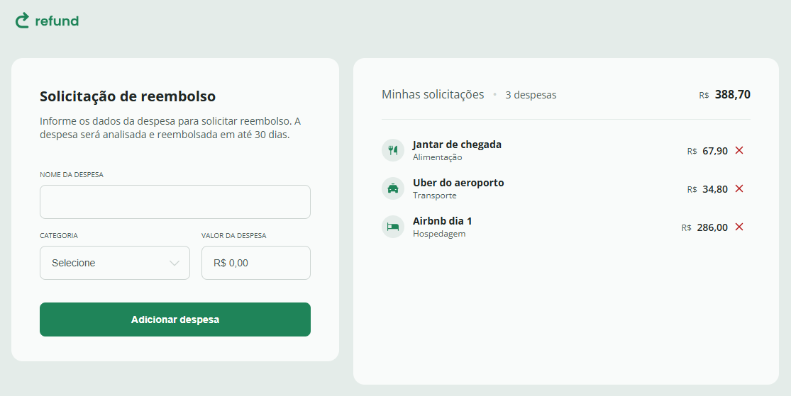

<h1 align="center"> Refund - Sistema de Reembolso </h1>

  Uma aplicação web para gerenciamento e solicitação de reembolsos de despesas corporativas.

  <a href="#-tecnologias">Tecnologias</a>&nbsp;&nbsp;&nbsp;|&nbsp;&nbsp;&nbsp;
  <a href="#-projeto">Projeto</a>&nbsp;&nbsp;&nbsp;|&nbsp;&nbsp;&nbsp;
  <a href="#-layout">Layout</a>&nbsp;&nbsp;&nbsp;|&nbsp;&nbsp;&nbsp;
  <a href="#memo-licença">Licença</a>

  

 

  

## 🚀 Tecnologias

Esse projeto foi desenvolvido para aprimorar a lógica de programação com JavaScript:

- HTML5
- CSS3
- JavaScript

## 💻 Projeto

O **Refund** é um sistema que permite aos colaboradores cadastrarem suas despesas (alimentação, transporte, hospedagem, etc.) para solicitar reembolso à empresa.
O foco técnico foi criar um fluxo de dados estruturado, onde cada despesa é tratada como um objeto antes de ser renderizada na tela.

Funcionalidades principais:
- **Formatação em Tempo Real:** O campo de valor utiliza `toLocaleString` para aplicar a máscara de moeda (BRL) instantaneamente enquanto o usuário digita.
- **Cálculo Dinâmico:** O sistema itera sobre os itens da lista para somar os valores e atualizar o cabeçalho de "Total" automaticamente.
- **Categorização Visual:** Cada despesa recebe um ícone específico baseado na categoria selecionada (`category_id`).
- **Delegação de Eventos:** A remoção de itens utiliza *Event Delegation* na lista pai para otimizar a performance de cliques.

🔗 [Acesse o projeto online](https://miqueiassantoss.github.io/project-refund/)

## 🔖 Layout

O layout responsivo apresenta um formulário de entrada de dados e um extrato lateral ("Minhas solicitações") que se ajustam para dispositivos móveis, garantindo boa usabilidade em qualquer tela.

## 📝 Licença

Esse projeto está sob a licença MIT.

---

  Feito por <a href="https://github.com/miqueiassantoss">Miqueias Santos</a>

